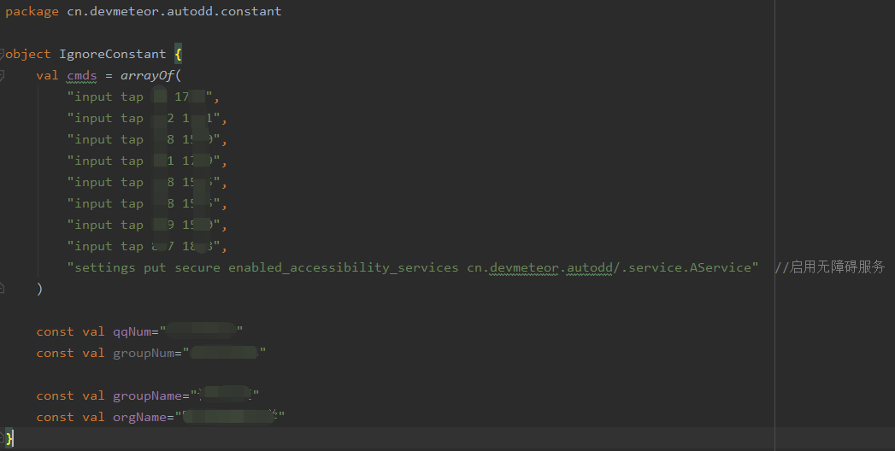

# AutoDD

**声明：本项目禁止用于非法用途或商用！！！**

**2020.06.26 部分情况下执行中途停止（例如打卡已经完成的情况下再次执行或当日打卡未开始）设备不会自动锁屏，所以添加长时间不进行下一步直接锁屏策略，初步设定为15s。**

**2020.06.09 已优化控件的搜索方式，在WebView的id不变和网页内文字属于text的前提下，不再受版本限制。**

### 项目简介

本项目基于Android的shell命令、无障碍能力和定时能力实现定时自动唤醒屏幕、输入锁屏密码解锁屏幕、打开钉钉进入表单页面提交表单、进入QQ群或者个人聊天界面发送消息、再次锁屏的功能。**上述功能在本人设备上可完全实现，但在其他设备上可能由于屏幕尺寸、锁屏界面结构而需要修改部分代码才能实现全部功能。clone导入studio之后会有报错的地方，需要按照注释新建和修改IgnoreConstant类。IgnoreConstant.kt的内容如图：**

**cmds是解锁点击命令的数组，qqNum和groupNum分别是发送消息的好友QQ号和群号，groupName和orgName分别表示签到到群名和组织名。**

其中shell命令部分实现模拟滑动锁屏页面和点击输入锁屏密码（需要root权限），无障碍（Accessibility）部分实现钉钉内提交表单和QQ内发送消息，定时部分（AlarmManager）实现在一定周期内定时执行任务。

安装后要将App加入电池优化白名单才能正常触发定时，加入开机自启白名单后开机后自动开始定时。建议将无障碍快捷方式设置为本应用，使用更方便。